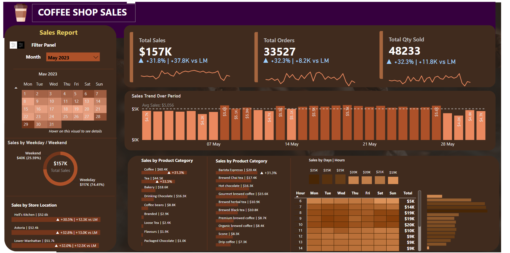
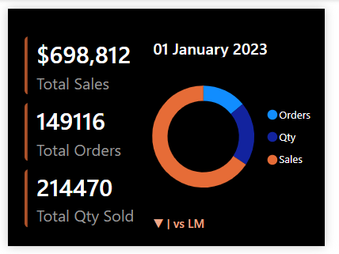
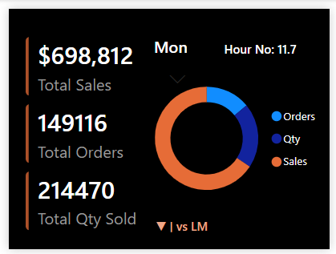

# Coffee Sales Analysis

## Tech Stack

- MySQL
- Microsoft Power BI
- Power Query
- DAX
- Data Modeling
- Data Visualization

> Interactive business intelligence solution developed to analyze coffee shop sales performance, monitor customer purchasing patterns, evaluate sales trends, and provide actionable insights through dynamic dashboards and advanced Power BI reporting.

  ---

## Dashboard Preview

### Sales Dashboard

### Calendar Tooltip

### Day & Hour Tooltip

---

## Business Problem

Coffee shop managers require timely and accurate sales insights to monitor business performance across multiple store locations, products, and customer purchasing trends. Without a centralized reporting solution, it becomes difficult to evaluate sales performance, compare monthly growth, identify top-performing products, and understand when customers are most likely to make purchases.

This project addresses these challenges by combining SQL and Power BI to develop an interactive sales dashboard that transforms raw transactional data into meaningful business insights, enabling stakeholders to make informed operational and strategic decisions.

---

## Project Objectives

The primary objective of this project was to build an interactive sales analytics dashboard that enables stakeholders to monitor key business metrics, evaluate sales performance, and identify trends across products, stores, and customer purchasing behavior.

Specifically, the solution was designed to:

- Monitor total sales, total orders, and total quantity sold.
- Analyze Month-over-Month (MoM) sales performance.
- Compare weekday and weekend sales.
- Evaluate sales performance across store locations.
- Identify the highest-performing product categories and products.
- Analyze customer purchasing patterns by day and hour.
- Build interactive dashboards using advanced DAX measures, custom tooltips, and dynamic filtering.

---

## Solution Overview

The solution combines SQL for data preparation and business analysis with Power BI for interactive reporting and visualization.

The dataset was first cleaned and transformed using MySQL, where business metrics such as total sales, orders, quantity sold, Month-over-Month (MoM) growth, and sales trends were calculated and validated.

The cleaned dataset was then imported into Power BI, where Power Query, data modeling, DAX measures, conditional formatting, custom tooltip pages, and interactive slicers were used to create a dynamic dashboard that provides insights into sales performance, customer purchasing behavior, product performance, and store operations.

---

## SQL Analysis

Before building the Power BI dashboard, the dataset was cleaned, transformed, and analyzed using MySQL.

SQL was used to:

- Clean and standardize the dataset.
- Convert transaction dates and times into appropriate data types.
- Calculate business KPIs.
- Perform Month-over-Month (MoM) sales analysis.
- Analyze sales by product, store location, weekday, hour, and month.
- Develop business logic using window functions, subqueries, CASE expressions, and aggregate functions.
- Validate Power BI measures before visualization.

All SQL queries and their corresponding outputs have been documented and included in this repository.

---

## DAX Measures

Advanced DAX measures were developed to enhance reporting and create dynamic KPI cards.

Key DAX measures include:

- Current Month (CM) Sales
- Previous Month (PM) Sales
- Current Month Orders
- Previous Month Orders
- Current Month Quantity Sold
- Previous Month Quantity Sold
- Month-over-Month (MoM) Growth
- Dynamic KPI Indicators
- Dynamic Labels
- Tooltip Measures

DAX variables (`VAR`) were extensively used to improve readability, maintainability, and performance of complex calculations.

---

## SQL Techniques Used

Throughout this project, SQL was used for:

- Data Cleaning & Preparation
- Data Type Conversion
-Window Functions (`LAG()`)
- PARTITION BY Analysis
- Subqueries
- Aggregate Functions (SUM, COUNT, AVG)
- CASE Expressions
- GROUP BY Analysis
- Month-over-Month (MoM) Analysis
- Business KPI Calculations

---

## Dashboard Overview

The report consists of one interactive dashboard supported by custom tooltip pages.

### Main Dashboard

Provides a complete overview of coffee shop sales performance, including KPIs, sales trends, store performance, product analysis, and customer purchasing behavior.

### Calendar Tooltip

Displays daily sales performance with conditional formatting, allowing users to quickly identify above-average and below-average sales days.

### Day & Hour Tooltip

Provides detailed sales insights by weekday and hour, helping identify peak business periods.

---

## Dashboard Features

Key dashboard features include:

- Interactive KPI Cards
- Month-over-Month (MoM) Growth Analysis
- Sales Trend Visualization
- Store Location Comparison
- Product Category and Product Performance Analysis
- Weekday vs Weekend Sales Comparison
- Calendar Heat Map
- Day & Hour Heat Map
- Interactive Slicers
- Dynamic KPI Labels
- Custom Tooltip Pages

---

## Advanced Power BI Features

This dashboard incorporates several advanced Power BI techniques to improve usability and analytical depth, including:

- DAX Variables (`VAR`) for cleaner and more efficient calculations.
- Dynamic KPI Cards with trend indicators.
- Dynamic Labels using DAX.
- Custom Tooltip Pages for detailed drill-down analysis.
- Conditional Formatting to highlight sales performance.
- Interactive Calendar Heat Map.
- Day & Hour Sales Heat Map.
- Cross-filtering between visuals.

---

## Business Impact

This dashboard transforms raw transactional data into meaningful business insights that support operational and strategic decision-making.

The solution enables stakeholders to:

- Monitor overall sales performance in real time.
- Compare Month-over-Month (MoM) business growth.
- Identify high-performing products and store locations.
- Understand customer purchasing behavior across different days and hours.
- Support inventory planning and staffing decisions using sales trends.
- Improve business reporting through interactive dashboards and dynamic KPI tracking.

---

## Key Insights

The dashboard helps decision-makers quickly identify:

- Overall sales performance.
- Month-over-Month (MoM) growth trends.
- Peak sales hours and busiest days.
- Store locations generating the highest revenue.
- Best-selling product categories and products.
- Weekday versus weekend purchasing behavior.
- Daily sales performance compared with monthly averages.
- Customer purchasing patterns across time.

---

## Key Skills Demonstrated

- SQL
- MySQL
- Data Cleaning
- Window Functions
- Power Query
- Data Modeling
- DAX
- DAX Variables (VAR)
- Power BI
- Dashboard Design
- KPI Reporting
- Business Intelligence
- Data Visualization

---

## Repository Contents

- `coffee-sales-analysis.pbix` – Interactive Power BI dashboard.
- `coffee-sales-analysis.sql` – SQL queries used for data cleaning and business analysis.
- `coffee-sales-sql-documentation.pdf` – SQL queries with outputs and explanations.
- `coffee-shop-sales.csv` – Dataset used for analysis.
- `dashboard-overview.png` – Main dashboard preview.
- `tooltip-calendar.png` – Calendar tooltip preview.
- `tooltip-day-hour.png` – Day & Hour tooltip preview.
- `README.md` – Project documentation.

---

## What I Learned

Through this project, I strengthened my SQL and Power BI skills by working with advanced analytical techniques such as DAX variables (`VAR`), window functions, custom tooltip pages, conditional formatting, and dynamic KPI reporting.

I also gained a deeper understanding of how SQL can be used to validate business metrics before implementing them in Power BI, helping ensure reporting accuracy and consistency.

---

## Future Improvements

Future enhancements may include:

- Automating data refresh using cloud data sources.
- Expanding customer segmentation analysis.
- Adding drill-through pages for product-level insights.
- Incorporating sales forecasting and trend analysis.
- Enhancing executive reporting with additional KPIs.

---

## Report Highlights

This project showcases several advanced Power BI capabilities, including:

- Dynamic KPI Cards
- Month-over-Month (MoM) Analysis
- SQL Validation of Power BI KPIs
- DAX Variables (`VAR`)
- Window Functions in SQL
- Custom Tooltip Pages
- Dynamic Labels
- Conditional Formatting
- Calendar Heat Maps
- Interactive Slicers

---
  
## About This Project

This project was developed as part of my data analytics learning journey to strengthen my SQL and Power BI skills through a real-world retail sales analysis scenario.

The project demonstrates a complete analytics workflow, beginning with SQL data cleaning and business analysis in MySQL before progressing to Power Query transformations, data modeling, advanced DAX development, interactive reporting, and dashboard design in Power BI.

While the dataset is publicly available for educational purposes, all SQL development, Power BI modeling, DAX calculations, dashboard design, and project documentation were completed independently as part of my portfolio.

  
